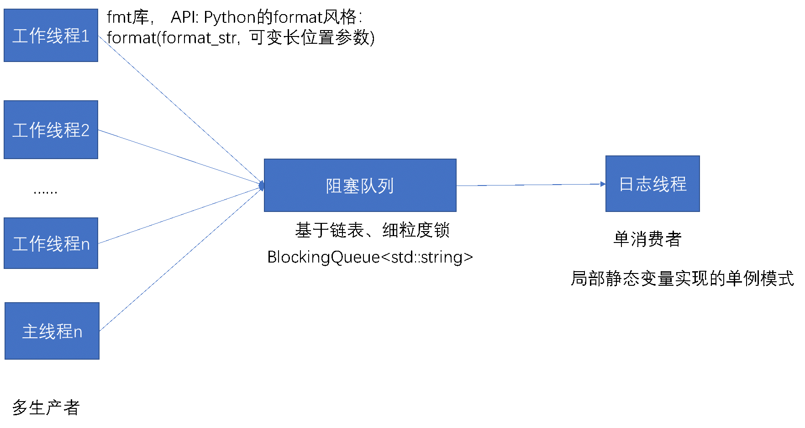

# webserver

> 实际场景1：Web服务器一般而言是I/O密集的，比如经常读写文件，访问数据库等。由于I/O操作远远没有CPU的计算速度快，所以让程序阻塞于I/O操作将浪费大量的CPU时间。如果程序有多个执行线程，则当前被I/O操作锁阻塞的执行线程可以主动放弃CPU（或由操作系统来调度），并将执行权转移到其他线程，这样一来CPU就可以做更加有意义的事情，而不是等待I/O操作完成，因此CPU的利用率显著提升。
#### 解决方案：
##### 并发模式：

采用多线程并发的方式来协调处理I/O事件和客户逻辑，可以有效提高CPU利用率，其中主线程管理监听socket，工作线程管理连接socket。当有新的连接到来时，主线程就接受该连接，并将新返回的连接socket派发给某个工作线程，此后该连接socket上的任何I/O操作都由被选中的工作线程来处理，直到客户端关闭连接。


1.	当新的连接socket到来时，主线程需要采用某种选择算法从线程池中选取一个工作线程来管理该连接socket。一般来说有两类选择算法：一是主线程主动选择工作线程，最简单、最常用的算法是随机算法和Round Robin算法，但更优秀、更智能的算法将使得任务在各个工作线程中更均匀地分配，从而减轻服务器地整体压力。二是主线程和所有子线程通过一个共享地工作队列来同步，子线程都睡眠在该工作队列上，相当于“单生产者-多消费者”模型。当有新的任务到来时，主线程将任务添加到工作队列。这将唤醒正在等待任务的子线程，只不过只有一个子线程将获得新任务的“接管权”，它可以从工作队列中取出任务并执行，而其他子线程将继续睡眠在工作队列上。_本实现中主线程使用Round Robin的方式来选择待派发的工作线程。_

2.	当选择好工作线程之后，工作线程此时可能正阻塞在I/O多路复用epoll_wait的调用中，主线程还需要使用某种通知机制来告诉工作线程有新的任务需要处理，并传递必要的数据。传统的办法是在主线程和工作线程中预先建立一条管道，工作线程始终监视此管道的可读事件，在需要唤醒的时候，其主线程往管道里写一个字节，这样工作线程就从I/O多路复用的阻塞调用中返回。现在Linux有了eventfd(2)，可以更高效地唤醒，因为它不必管理缓冲区。_本实现中主线程使用eventfd异步唤醒的方式来通知工作线程。_


> 实际场景2：一个网络连接如果若干秒没有收到数据，就被认定为空闲连接或非活动连接。空闲连接占用了连接资源，或严重影响服务器性能。如果一个连接连续几秒（例如8秒）内没有收到数据，服务器端就可以选择主动把该连接断开。需要注意的是在严肃的网络程序中，应用层的心跳协议是必不可少的。应该用心跳消息来判断对方进程是否能正常工作，“踢掉空闲连接”只是一时的权宜之计。
#### 解决方案1：
每个连接保存最后收到数据的时间，然后用一个定时器，每隔固定时间遍历所有连接，断开那些最后收到数据的时间大于8秒的连接。这种做法全局只有一个repeated timer，不过每次timeout都要检查全部连接，如果连接数目比较大（几千上万），这一步可能会比较费时。

#### 解决方案2：
每个连接设置一个one-shot timer，超时定为8s，在超时的时候就断开本连接。当然，每次收到数据要去更新timer。这种做法需要很多个one-shot timer，会频繁地更新timers。如果连接数目比较大，可能对EventLoop的TimerQueue造成压力。

例如可以利用alarm函数周期性的触发SIGALRM信号，该信号的信号处理函数利用管道/eventfd通知主循环执行定时器上的定时任务——关闭非活动连接。在多线程程序中处理信号是个相当麻烦的事情，应当尽量避免。再说，如果主程序和程序库都使用SIGALRM，就糟糕了。系统只有一个SIGALRM，所以这个是全局timer。

timerfd_create(2)把时间变成了一个文件描述符，该“文件”在定时器超时的那一刻变得可读，这样就能很方便地融入select(2)/poll(2)框架中，用统一的方式来处理IO事件和超时事件，这也正是Reactor模式的长处。可以在epoll中注册多个timerfd,所以timerfd可以是多个one-shot timer，也可以是全局的repeated timer。

#### 解决方案3：时间轮
#### 解决方法4：时间堆
时间堆可以有多种实现方式，例如将所有定时器中超时时间最小的定时器的超时值作为心搏间隔。这样一旦心搏tick被调用，超时时间最小的定时器必然到期，这样就可以在tick函数中处理该定时器，然后再从剩余超时时间最小的一个，并将这段最小时间设置为下一次心搏间隔。如此反复，就实现了较为精确的定时。

_本实现中每一个线程中都持有一个定时器优先队列，超时时间最小的定时器会位于队首，并没有注册timerfd和使用SIGALRM信号，所以即使某个定时器的超时发生也不会唤醒线程，而选择在主循环的最后检查队列中的定时器是否超时，如果超时了再删从队列中删除该定时器。这样考虑的原因是这里对超时的要求并不高，即使队列中有部分定时器已经超时很久了，最后在主循环中这些空闲连接也会被剔除的。_

> 实际场景3：掌握服务器的运行状态对开发人员进行调试和性能优化，运维人员进行服务器维护非常帮助。服务器通过自动创建日志来记录其运行状态，错误信息和访问数据的情况。在多线程程序中，日志库应该实现线程安全，即多个线程可以并发写日志，两个线程的日志消息不会出现交织。如果用一个全局互斥锁保护I/O或者每个线程单独写一个日志文件的话，前者全部线程会争抢一个锁，后者则可能会让工作线程阻塞在磁盘I/O上。如果考虑采用多线程异步日志的方法来实现日志模块的话，就需要在后台启动一个背景线程负责将前端线程产生的日志写入到磁盘文件上，前端工作线程只需要往后端的背景线程中发送日志消息即可。但难点在于将日志数据从多个前端高效地传输到后端。为此我们需要一个“队列”来将日志前端的数据传送到后端（日志线程）这是一个典型的多生产者-单消费者问题，对生产者（前端）而言，要尽量做到低延迟、低CPU开销、无阻塞；对消费者（后端）而言，要做到足够大的吞吐量，并占用较少资源。

#### 解决方案：高效的多线程异步日志



_本实现中采用基于链表（使用细粒度锁）的无界阻塞队列来实现日志消息的传递：生产者每产生一条日志（表示为std::string），就往阻塞队列BlockQueue<std::string>中尾部push一条日志消息，同时通知消费者从阻塞队列中取消息；消费者等待在阻塞队列头部，从队列中不断的取出日志，同时往磁盘上写I/O。_

在前端日志写入函数的API风格上采用了Python的format风格:  format(format_str,  positional_args)。借用了fmt库，优点是性能好，类型安全，能自动管理内存，编译时给出错误提醒，已经进入c++20标准。而没有使用C的printf(fmt, ...)风格，print存在类型安全问题和·C++的stream <<风格，iostream存在性能慢的问题。利于在前台记录的日志写入函数如下
```
for(int i = 0; i < 1000000; ++i)
    LOG_INFO(" I'm very good {} ", i);
```
则在日志线程在磁盘写入的日志格式如下：包含日期、时间（精确到微秒），线程号，日志级别（支持INFO、WARN、DEBUG和ERROR）以及打印日志的代码文件名和所在行号
```
// 日期        时间      微妙     线程号（无语义意义） 日志级别  正文                  源文件:行号 
// 2021-03-03  22:09:18.611678Z  3102627584         INFO     I'm very good 678913  log_test3.cpp:22
```
#### 改进之处

1. 因为日志库不能每条消息都flush硬盘，更不能每条日志都open/close文件，这样性能开销太大。可以采用是定期（例如3秒）将缓冲区内的日志消息flush到硬盘。
2. 日志消息堆积问题，万一前端陷入死循环，拼命发送日志消息，超过后端的处理（输出）能力。对于异步日志来说，这就是典型的生产速度高于消费速度问题，会造成数据在内存中堆积，严重时引发性能问题（可用内存不足）或程序崩溃（分配内存失败）。可以采用有界阻塞队列，控制生成者的写入速度；但是此时生成者就会阻塞在队列上，影响正常的业务流程，简单的解决办法是直接丢弃掉超出范围的日志，将来应该加上网络报警功能，通知人工介入，以尽快修复故障。（主要是设计大小合理的阻塞队列，保证消费速度大于等于生产速度）
3. 队列不必是现成的BlockingQueue<std::string>，因为不用每次产生一条日志消息都通知（notify()）接收方。生产者可以先往缓冲中写，等待缓冲满后再往通知消费者往磁盘I/O上写；当消费者在把缓冲中的日志往磁盘上的时候，生产者在此时产生的日志可以写另外一块缓冲中；如此而来两个缓冲交替使用，我们简称为双缓冲策略。

#### 其他方案的一些思考
1. Linux内核中有用kfifo实现循环缓冲，之前有想过这样做，但是考虑再三之后，不使用环形缓冲，在我的设计里面，子线程生产的日志类型是string，长度是不确定的（这里可以虑转换成char，那么使用循环缓冲是有意义的）。这里我使用基于链表的阻塞队列。
## to-do
~~1. 异步日志：多生成者-单消费者~~ 实现了多生产者-单消费者的异步日志，消息传递使用基于链表的无界阻塞队列。

~~2. 线程：使用c++11`<thread`>库中自带的thread~~ 日志模块中使用了std::thread

~~3. 测试：进一步详细测试代码~~  在日志模块中写了部分简单的测试代码

## 参考文献
1. [游双. Linux高性能服务器编程[M]. 北京:机械工业出版社,2013.](https://book.douban.com/subject/24722611/) 
2. [陈硕. Linux多线程服务端编程——使用muduo C++网络库. 北京:电子工业出版社,2013](https://book.douban.com/subject/20471211/)
3. https://github.com/chenshuo/recipes
4. https://github.com/linyacool/WebServer
5. https://github.com/qinguoyi/TinyWebServer
6. https://github.com/fmtlib/fmt
